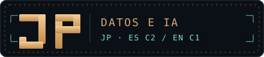

  

  

  <strong>Juan Pablo Granados Coral</strong> 
  Ingeniero de Datos e Inteligencia Artificial 
  Python · SQL · Docker · AWS · Databricks · RAG

  <em>Junior Data / ML–AI Engineer. ES C2 · EN C1.</em>

  <a href="https://www.linkedin.com/in/juan-pablo-g-125275219/">LinkedIn</a>
  ·
  <a href="mailto:juanpablogranadoscoral@gmail.com">Email</a>
  ·
  <a href="https://github.com/JhinPablo">GitHub</a>

  

## Foco

- Primario: Data Engineer / ML–AI Engineer junior
- Útil: healthtech (HL7 FHIR) y full-stack ligero (React/TS)

## Formación

- Ing. Datos e IA, UAO — egresado jul 2026 (ago 2022 – jul 2026)
- AWS Cloud Practitioner 2026 (Generation Chile / AWS re/Start, 482 h)
- ES C2 · EN C1

## Experiencia

- **NCL** — Emergencias aéreas (jun–nov 2025): presión + app NLP reportes
- **Fundación Univalle** — Implementación plataforma digital (oct–nov 2024)
- ParqueSoft (jul–sep 2021)

## Proyectos

- [DigitalHealthWeb](https://github.com/JhinPablo/DigitalHealthWeb) — FHIR R4, FastAPI, Docker, ONNX
- [OCR Scanner](https://github.com/JhinPablo/OCR_scanner) — OCR local en el navegador (PaddleOCR / ONNX)
- [Local RAG / Document QA](https://github.com/JhinPablo/Seduction_RAG) — Ollama + ChromaDB

## Skills

- **Núcleo:** Python, SQL, Docker, FastAPI, PostgreSQL, Git, TypeScript
- **ML:** ONNX, RAG, Ollama
- **Cloud:** AWS CP, Databricks

  
  
  
  
  
  

  
  

