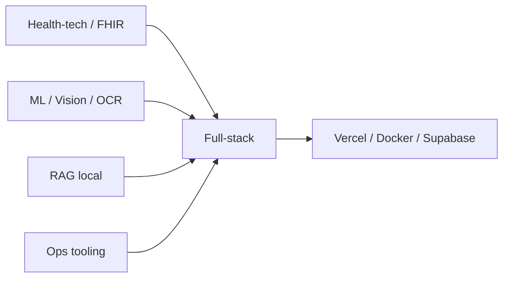

<!--
  Handshake for humans who view source (recruiters, you count):
  TALLER-NOCTURNO / 0x4A50
  El CRM funerario es privado a propósito. El OCR corre 100% local.
  No hay PATs en este archivo. Si llegaste hasta acá, pregunta por el canal 04.
  JP was here. The coffee cliché was left on the cutting-room floor.
-->

  

<pre align="center">
  ╻┏━┓     taller nocturno
  ┃┣━┛     JP · JG
  ╹╹       es / en · building
</pre>

  <a href="#01--señal--signal"><code>[1] señal</code></a>
  ·
  <a href="#02--inventario-del-lab"><code>[2] inventario</code></a>
  ·
  <a href="#03--mapa-de-intereses"><code>[3] mapa</code></a>
  ·
  <a href="#04--telemetría"><code>[4] telemetría</code></a>
  ·
  <a href="#05--canal"><code>[5] canal</code></a>

  

## 01 · Señal / Signal

Estudiante de **desarrollo de software en ParqueSoft**. Armo herramientas que aguantan el día a día: ops, salud digital, visión por computador y RAG que corre en máquina propia.

*Software development student at ParqueSoft. I build operational software, health-tech, computer vision, and local-first RAG. ES / EN.*

<table>
  <tr>
    <td width="33%" valign="top">
      <code>SHIPPING</code> 
      <strong>CRM funerario / ops tooling</strong> 
      Next.js · Supabase · Vercel 
      <em>Private on purpose. No public URL.</em>
    </td>
    <td width="33%" valign="top">
      <code>LEARNING</code> 
      RAG con métricas de verdad, visión (pose / OCR), producto full-stack que se despliega sin drama.
    </td>
    <td width="33%" valign="top">
      <code>OPEN TO</code> 
      Health-tech, tooling interno, full-stack con impacto. Colaborar en ES o EN.
    </td>
  </tr>
</table>

## 02 · Inventario del lab

No es un dump de repos. Son las piezas que definen el taller.

<table>
  <tr>
    <td width="50%" valign="top">
      <code>OPS · PRIVATE</code> 
      <strong>CRM funerario</strong> 
      Operación real: flujos, datos, despliegue. El repo no es público; el trabajo sí existe. 
      <em>Funeral-ops CRM. Next.js / Supabase / Vercel.</em>
    </td>
    <td width="50%" valign="top">
      <code>OPS · PUBLIC</code> 
      <strong><a href="https://github.com/JhinPablo/NCL_v2">NCL_v2</a></strong> 
      Portal web de herramientas para un equipo de phones: comentarios, Excel, decodificador, asistencia con AI. 
      <em>Internal ops portal. Gradio → web.</em>
    </td>
  </tr>
  <tr>
    <td width="50%" valign="top">
      <code>VISION · EDGE</code> 
      <strong><a href="https://github.com/JhinPablo/OCR_scanner">OCR_scanner</a></strong> 
      Extensión Edge: recorte de región + OCR local (PaddleOCR + ONNX WASM). Cero servidor. 
      <em>Region capture. On-device OCR. Nothing leaves the machine.</em>
    </td>
    <td width="50%" valign="top">
      <code>VISION · 3D</code> 
      <strong><a href="https://github.com/JhinPablo/VitPose_ProyectoFinal">VitPose_ProyectoFinal</a></strong> 
      Webcam → ViTPose → keypoints → IK → modelo 3D, con Streamlit. 
      <em>Real-time pose to 3D animation.</em>
    </td>
  </tr>
  <tr>
    <td width="50%" valign="top">
      <code>RAG · LOCAL</code> 
      <strong><a href="https://github.com/JhinPablo/Seduction_RAG">Seduction_RAG</a></strong> 
      Ollama + Chroma + corpus de cocina e interculturalidad. Recuperación medida (Hit@4, MRR), no demo de juguete. 
      <em>Local RAG. Context over vibes.</em>
    </td>
    <td width="50%" valign="top">
      <code>GEN · WORKSHOP</code> 
      <strong><a href="https://github.com/JhinPablo/DifussionModelsWorkshop">DifussionModelsWorkshop</a></strong> 
      DDPM desde cero, FID, y una caminata por el latente de Stable Diffusion. 
      <em>Generative-image workshop, not a prompt dump.</em>
    </td>
  </tr>
  <tr>
    <td width="50%" valign="top">
      <code>HEALTH · CLUSTER</code> 
      <strong>Bahía FHIR</strong> 
      <a href="https://github.com/JhinPablo/DigitalHealthWeb">DigitalHealthWeb</a>
      · <a href="https://github.com/JhinPablo/HealthDashboard">HealthDashboard</a>
      · <a href="https://github.com/JhinPablo/AppSaludDigital">AppSaludDigital</a>
      · <a href="https://github.com/JhinPablo/FIHR_Platform">FIHR_Platform</a> 
      Historias clínicas interoperables, RBAC, cifrado, dashboards. FastAPI / Nest / Next / Streamlit. 
      <em>FHIR-lite health-tech, several angles, same obsession.</em>
    </td>
    <td width="50%" valign="top">
      <code>TOOLING · DX</code> 
      <strong><a href="https://github.com/JhinPablo/vibedit">vibedit</a></strong> 
      Overlay visual para React: clic, editas estilo/texto, el AST escribe en el source. Local, sin nube. 
      <em>Click the UI. Patch the file. Stay on-device.</em>
    </td>
  </tr>
</table>

## 03 · Mapa de intereses

Cómo se conecta el taller cuando no está disfrazado de lista de skills:

  
  
  
  
  
  
  
  
  

## 04 · Telemetría

Números reales, paleta del taller. Sin ranking de videojuego.

  
  

  

## 05 · Canal

<table>
  <tr>
    <td width="50%" valign="top">
      <code>ES</code> 
      Si el problema es ops, salud, visión o un RAG que no se vaya a la nube, abre un issue en este repo o escribe desde GitHub.
    </td>
    <td width="50%" valign="top">
      <code>EN</code> 
      If it is ops, health-tech, vision, or local RAG, open an issue here. Profile is marked hireable.
    </td>
  </tr>
</table>

  
  
  
  

Taller nocturno · no stock GIFs · no coffee bio · scanlines optional

